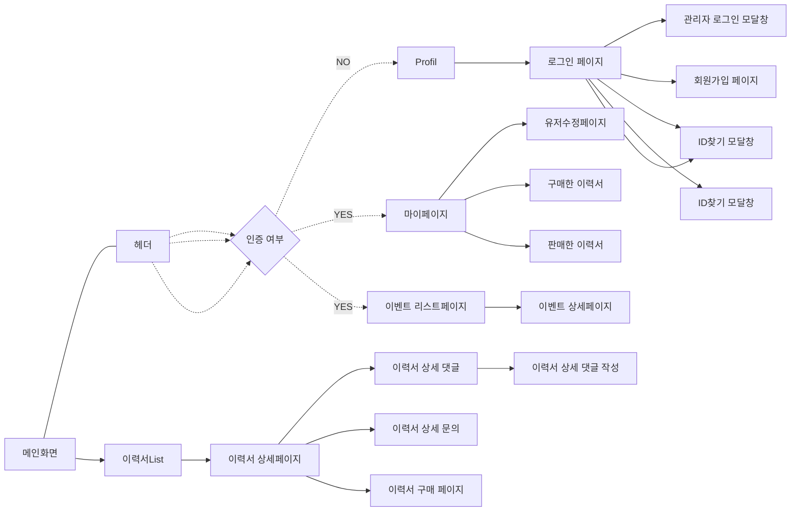

## DevCV_FE

_현업자의 이력서를 공유하며 취업에 도움을 주는 서비스입니다._

### User Flow

**User**

### 기술스택

`Nextjs`, `TypeScript`, `Tailwindcss`, `Github Actions`, `aws`, `pnpm`

---

### 프로젝트 정보

코로나 팬데믹때 IT붐으로 인해 개발자 수요가 증가하였지만 금리가 인상과 세계정세가 흔들리면서 시장에 현금유동성이 떨어지기 시작했습니다.

얼마 지나지 않아 개발자 시장은 수요는 줄고 공급이 늘어나버리는 사태가 일어나게 되었습니다. 저희는 이러한 개발자들이 선호하는 이력서, 기술 스택, 기업규모를 체크하고 그에 맞는 솔루션을 제공하고자 프로젝트를 기획, 개발하게 되었습니다.

기획 기간: **2024.05.20 ~ 2024.05.26**
개발 기간: **2024.05.27 ~ 2024.07.09**

---

### 트러블 슈팅

- 블로그에 올려서 링크 올리기

[next.JS nextjs parallel interception 트러블 슈팅](https://toris-dev.tistory.com/33)

---

### 배포주소

#### [DevCV](http://devcv.net)

---

### 팀 정보

- [Toris-dev](https://github.com/toris-dev) (ironjustlikethat@gmail.com)
- [Taehyeonn](https://github.com/Taehyeonn) (97taehyun@gmail.com)
- [luxihua](https://github.com/luxihua) (maseoyoung12@gmail.com)
- [pangyosim](https://github.com/pangyosim) (spg9687@gmail.com)

---

### [디자인](https://github.com/DevCVTeam/DevCV-frontend/wiki/Figma-%EB%94%94%EC%9E%90%EC%9D%B8)

  
  

   
  

  
  
   

